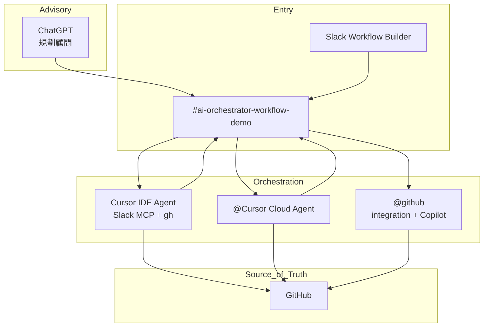

# 架構說明

## 三層模型

## 執行路徑

### 1. Cursor IDE Agent（主編排）

- **觸發**：在 Cursor 開啟本 repo 並下達任務；或未來以 SDK/cron 觸發 local agent。
- **工具**：Slack MCP（讀寫 thread）、`gh`、git、repo 檔案。
- **適用**：編排、狀態回報、輕量修改、`docs/progress.md` 更新。

### 2. @Cursor Cloud Agent（Slack 觸發）

- **觸發**：Slack 內 `@Cursor [prompt]`。
- **工具**：遠端 VM、GitHub clone、可開 PR。
- **適用**：較重的實作、需隔離環境的 coding。
- **設定**：[Cursor Slack 整合](https://cursor.com/docs/integrations/slack)、[Cloud Agents](https://cursor.com/docs/cloud-agent)。

### 3. @github（GitHub App：整合 + Copilot agent）

同一 Slack bot（`U0B3VUN3QA1`），兩種觸發方式：

| 模式 | 觸發 | 用途 |
|------|------|------|
| 整合 | `/github subscribe|open|close` | 通知、issue、thread→既有 PR |
| Copilot agent | `<@U0B3VUN3QA1> In owner/repo, …` | 非同步寫 code、開 PR（需 Copilot 訂閱） |

- **適用**：GitHub 生態內 Slack 實作；與 `@Cursor` 擇一。
- **不做**：取代 Cursor 編排與 `docs/progress.md` 主控。
- **參考**：[Copilot + Slack](https://docs.github.com/copilot/how-tos/use-copilot-agents/coding-agent/integrate-coding-agent-with-slack)、[slack-bot-mention-tests.md](slack-bot-mention-tests.md)

### 4. Slack Workflow Builder（僅入口）

- **觸發**：shortcut `/demo-project`、排程、表單。
- **不做**：主控邏輯、GitHub 操作（由 Cursor 接手）。
- **限制**：repo 內 YAML **不會**自動部署到 Slack（見 [slack-capability-matrix.md](slack-capability-matrix.md)）。

## 資料流（典型需求）

1. 顧問層（ChatGPT）產出規格 → 貼入 Slack thread。
2. Cursor 讀 thread（`slack_read_thread` / `slack_read_channel`）。
3. Cursor 建立 GitHub issue、branch，更新 `docs/progress.md`。
4. Cursor 在 thread 回報連結與狀態；必要時 `@mention` roster 中的 bot。
5. 交付以 PR 合併為準；Slack 留 audit trail。

## Primary vs Cloud（避免重複執行）

| 情境 | Primary | Cloud |
|------|---------|-------|
| 編排、進度、issue 建立 | IDE Agent | — |
| 大型 refactor、多檔實作（Cursor 生態） | 可委派 | `@Cursor` |
| 大型 refactor（GitHub 生態） | 可委派 | `<@U0B3VUN3QA1> In repo, …` |
| PR 通知訂閱 | IDE 提示 | `/github subscribe` |
| 同一 thread 已有 Cloud Agent | follow-up 或擇一 | 勿同時 @ Cursor + GitHub Copilot 任務 |

契約詳見 [agent-contract.md](agent-contract.md)。

## Repo 契約檔

| 路徑 | 用途 |
|------|------|
| `.workflow-specs/slack-demo-request.yml` | 機器可讀 workflow contract |
| `.workflow-specs/slack-demo-request.md` | 人類 runbook |
| `docs/progress.md` | 執行進度（GitHub 為準） |
